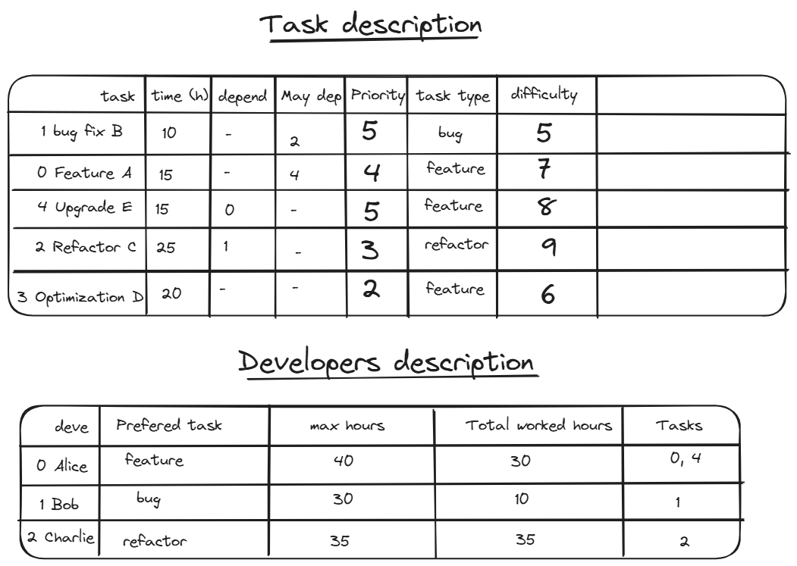
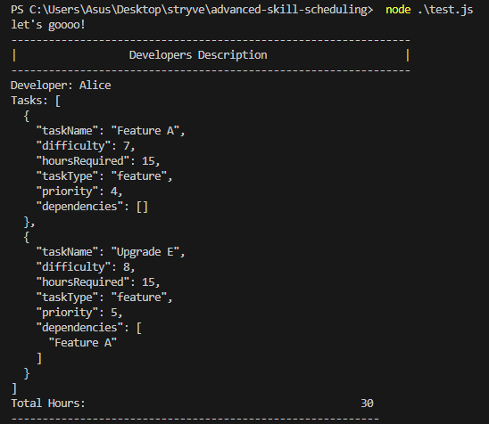
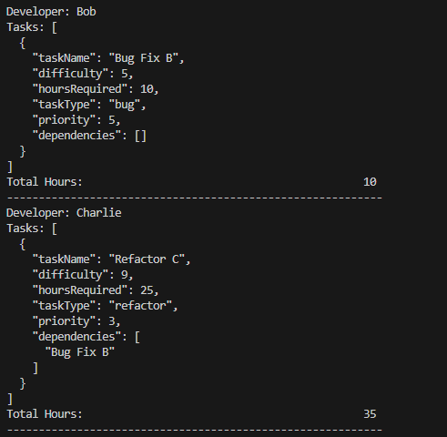
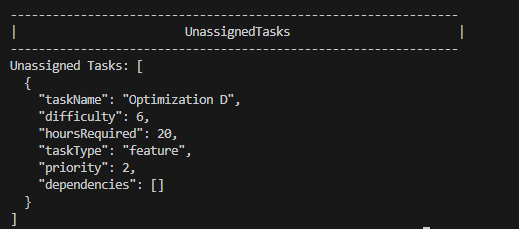

# JavaScript Technical Test - Advanced Task Scheduling

## Problem Statement: Dynamic Task Allocation with Priority, Dependencies, and Resource Constraints
You are given a set of developers and tasks, each with its own properties. Your goal is to assign
tasks to developers based on their skills, available hours, and task preferences. Some tasks have
dependencies and priorities. You must ensure that the task allocation satisfies these constraints
while distributing work as evenly as possible.


## Tasks and objectives

- Assigns tasks to developers based on their skill levels, available hours, task preferences,
 priorities, and dependencies.
- Ensures that tasks with dependencies are only assigned after their prerequisites are complete.
- Returns an array of developers with their assigned tasks and total work hours.
- Lists unassigned tasks if no developer can handle them.
- Prioritizes high-priority tasks while balancing the workload.


## Algorithm


- Sort Tasks:
  - Sort the tasks list based on priority and difficulty to ensure that higher priority tasks are considered first.

- Iterate Over Tasks:
  - Check each developer to see if they can take on the task based on the following conditions:
    - The developer's preferredTaskType matches the taskType.
    - The sum of developer.totalHours and task.hoursRequired does not exceed developer.maxHours.
    - All dependencies of the task are already assigned (using isDependenteTaskAreAsigned function).

- Handle Task Dependencies:
  - if the task has assigned dependencies I calculate the needed time for their accomplishement to make sure that the main task start after the completion of it's dependencies.
  - if the task has higer priority and dependencies I assign it dependencies then the main to respect the priority order.
  - I maintained also each developer max hours

- Unassigned tasks:
  - at the end I filtered the arrays to keep unassigned tasks

- Output function
  - this function is to controll the output.

> I will provide more information about the algorithm in our meeting.


### Run the test file
You need node js to run the test file
```
node .\test.js
```

## OUTPUT





